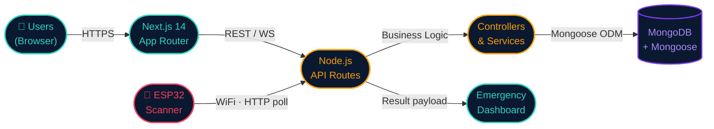

<!-- ══════════════════════════════════════════════════
     SLIDE 1 — COVER
     ══════════════════════════════════════════════════ -->

  
Healthcare Platform · 2026

  <h1 style="text-align:left;margin-bottom:0.6rem;">
    MediTrack
  </h1>

  

    Unified healthcare appointments, medical records &amp; biometric emergency access — powered by ESP32 hardware.
  

  

    <a href="https://medi-track-sable.vercel.app/" style="display:inline-flex;align-items:center;gap:0.5rem;padding:0.65rem 1.4rem;background:var(--mt-teal);color:#030B1A;border-radius:5px;font-weight:700;font-size:0.85rem;letter-spacing:0.5px;text-decoration:none;">
      ↗ Live Demo
    </a>
    <a href="https://github.com/hrithik18k/Hack-a-Thon" style="display:inline-flex;align-items:center;gap:0.5rem;padding:0.65rem 1.4rem;background:transparent;color:var(--mt-teal);border:1.5px solid var(--mt-teal);border-radius:5px;font-weight:700;font-size:0.85rem;letter-spacing:0.5px;text-decoration:none;">
      ⌥ Source Code
    </a>
  

  

  

    MEDI-TRACK · HACKATHON 2026
  

---

<!-- ══════════════════════════════════════════════════
     SLIDE 2 — PROBLEM STATEMENT
     ══════════════════════════════════════════════════ -->

01 — Problem

02 / 10

<h2 style="margin-bottom:0.5rem;">The Problem</h2>

  

    
🧩

    
Fragmented Systems

    
Managing appointments, reports, and records across disconnected platforms is slow and error-prone.

  

  

    
🚨

    
Emergency Delays

    
Identifying an unconscious or unresponsive patient in critical care can cost precious minutes.

  

  

    
🔒

    
Data Silos

    
Doctors lack immediate, holistic access to a patient's medical history at the point of care.

  

  
💡

  

    <strong>The gap:</strong> No single platform bridges software healthcare workflows with hardware-level emergency identification.
  

---

<!-- ══════════════════════════════════════════════════
     SLIDE 3 — PROPOSED SOLUTION
     ══════════════════════════════════════════════════ -->

02 — Solution

03 / 10

  <!-- Left: text -->
  

    <h2 style="margin-bottom:0.5rem;">Our Solution</h2>
    

    

      MediTrack is an <strong>integrated ecosystem</strong> that connects patients, doctors, and administrators — augmented by real biometric hardware for life-critical moments.
    

    

      

        
●

        <strong>Patient booking</strong> &amp; profile management
      

      

        
●

        <strong>Doctor report</strong> management &amp; publication
      

      

        
●

        <strong>Admin dashboard</strong> for full system oversight
      

      

        
●

        <strong>Real-time notifications</strong> via Socket.io
      

      

        
★

        <strong>ESP32 fingerprint</strong> emergency patient lookup
      

    

  

  <!-- Right: visual callout -->
  

    

      <svg class="fp-glow" width="72" height="72" viewBox="0 0 24 24" fill="none" stroke="#2DD4BF" stroke-width="1.5" stroke-linecap="round" stroke-linejoin="round" style="margin:0 auto 1rem;">
        <path d="M12 10a2 2 0 0 0-2 2c0 1.02-.1 2.51-.26 4"/>
        <path d="M14 13.12c0 2.38 0 6.38-1 8.88"/>
        <path d="M17.29 21.02c.12-.6.43-2.3.5-3.02"/>
        <path d="M2 12a10 10 0 0 1 18-6"/>
        <path d="M2 17.5a14.5 14.5 0 0 0 4.24 5.5"/>
        <path d="M6 10a8 8 0 0 1 14.7-2.4"/>
        <path d="M6 14a6 6 0 0 1 11.94-1.5"/>
        <path d="M6.18 17A14 14 0 0 0 7 22"/>
      </svg>
      
Hardware-First

      
A fingerprint scan in an emergency instantly surfaces blood type, allergies, and full medical history.

    

  

---

<!-- ══════════════════════════════════════════════════
     SLIDE 4 — USER ROLES
     ══════════════════════════════════════════════════ -->

03 — Users

04 / 10

<h2 style="margin-bottom:0.5rem;">Who Uses MediTrack?</h2>

  

    
🧑‍⚕️

    <h3 style="color:var(--mt-teal) !important;margin-bottom:0.5rem;font-size:1.3rem !important;">Patients</h3>
    

    <ul style="list-style:none;padding:0;margin:0.75rem 0 0;display:flex;flex-direction:column;gap:0.45rem;">
      <li style="color:var(--mt-muted);font-size:0.85rem;">→ Register &amp; sign in securely</li>
      <li style="color:var(--mt-muted);font-size:0.85rem;">→ Search &amp; book doctors</li>
      <li style="color:var(--mt-muted);font-size:0.85rem;">→ View full medical history</li>
      <li style="color:var(--mt-muted);font-size:0.85rem;">→ Enroll fingerprint biometrics</li>
    </ul>
  

  

    
👨‍💼

    <h3 style="color:var(--mt-amber) !important;margin-bottom:0.5rem;font-size:1.3rem !important;">Doctors</h3>
    

    <ul style="list-style:none;padding:0;margin:0.75rem 0 0;display:flex;flex-direction:column;gap:0.45rem;">
      <li style="color:var(--mt-muted);font-size:0.85rem;">→ Apply for &amp; get verified</li>
      <li style="color:var(--mt-muted);font-size:0.85rem;">→ Manage appointment slots</li>
      <li style="color:var(--mt-muted);font-size:0.85rem;">→ Publish medical reports</li>
      <li style="color:var(--mt-muted);font-size:0.85rem;">→ Control ESP32 scanner device</li>
    </ul>
  

  

    
🛡️

    <h3 style="color:var(--mt-red) !important;margin-bottom:0.5rem;font-size:1.3rem !important;">Admins</h3>
    

    <ul style="list-style:none;padding:0;margin:0.75rem 0 0;display:flex;flex-direction:column;gap:0.45rem;">
      <li style="color:var(--mt-muted);font-size:0.85rem;">→ Platform-wide statistics</li>
      <li style="color:var(--mt-muted);font-size:0.85rem;">→ Approve / reject doctors</li>
      <li style="color:var(--mt-muted);font-size:0.85rem;">→ Manage users &amp; data</li>
      <li style="color:var(--mt-muted);font-size:0.85rem;">→ Full oversight dashboard</li>
    </ul>
  

---

<!-- ══════════════════════════════════════════════════
     SLIDE 5 — CORE FEATURES
     ══════════════════════════════════════════════════ -->

04 — Features

05 / 10

<h2 style="margin-bottom:0.5rem;">Core Features</h2>

  

    
🔐

    <strong style="font-size:0.82rem;display:block;margin-bottom:0.3rem;">Auth &amp; Roles</strong>
    
JWT + httpOnly cookie sessions with RBAC

  

  

    
🔍

    <strong style="font-size:0.82rem;display:block;margin-bottom:0.3rem;">Doctor Search</strong>
    
Filter by city &amp; specialization with live results

  

  

    
📅

    <strong style="font-size:0.82rem;display:block;margin-bottom:0.3rem;">Smart Booking</strong>
    
Dynamic slot generation based on doctor config

  

  

    
📋

    <strong style="font-size:0.82rem;display:block;margin-bottom:0.3rem;">Medical Reports</strong>
    
Rich reports with medications, images &amp; follow-up

  

  

    
🔔

    <strong style="font-size:0.82rem;display:block;margin-bottom:0.3rem;">Notifications</strong>
    
Real-time Socket.io alerts with unread badge counts

  

  

    
🗂️

    <strong style="font-size:0.82rem;display:block;margin-bottom:0.3rem;">Medical History</strong>
    
Collapsible timeline with Critical / Routine filters

  

  

    
⚙️

    <strong style="font-size:0.82rem;display:block;margin-bottom:0.3rem;">Device Setup</strong>
    
One-click ESP32 registration with secure token flow

  

  

    
🆘

    <strong style="font-size:0.82rem;display:block;margin-bottom:0.3rem;color:var(--mt-red) !important;">Emergency Scan</strong>
    
Fingerprint → instant patient ID &amp; full medical record

  

---

<!-- ══════════════════════════════════════════════════
     SLIDE 6 — UNIQUE FEATURE: ESP32
     ══════════════════════════════════════════════════ -->

05 — Unique Feature

06 / 10

  <!-- Left -->
  

    
★ Hardware Integration

    <h2 style="margin-bottom:0.75rem;">ESP32 Fingerprint Emergency Lookup</h2>
    

    
In critical situations where a patient is unresponsive, medical staff can scan their fingerprint to <strong>instantly retrieve vital records</strong> — blood type, allergies, medications, emergency contacts — directly on screen.

    

      

        ①
        <strong>Doctor registers</strong> the ESP32 device and gets a secure token
      

      

        ②
        ESP32 polls <code>/api/device/esp/mode</code> every <strong>3 seconds</strong>
      

      

        ③
        On match, POSTs result → web UI <strong>polls &amp; renders</strong> patient instantly
      

    

  

  <!-- Right: animated fingerprint -->
  

    

      <!-- Rings -->
      

      

      

      <!-- Icon -->
      <svg class="fp-glow" width="72" height="72" viewBox="0 0 24 24" fill="none" stroke="#2DD4BF" stroke-width="1.5" stroke-linecap="round" stroke-linejoin="round">
        <path d="M12 10a2 2 0 0 0-2 2c0 1.02-.1 2.51-.26 4"/>
        <path d="M14 13.12c0 2.38 0 6.38-1 8.88"/>
        <path d="M17.29 21.02c.12-.6.43-2.3.5-3.02"/>
        <path d="M2 12a10 10 0 0 1 18-6"/>
        <path d="M2 17.5a14.5 14.5 0 0 0 4.24 5.5"/>
        <path d="M6 10a8 8 0 0 1 14.7-2.4"/>
        <path d="M6 14a6 6 0 0 1 11.94-1.5"/>
        <path d="M6.18 17A14 14 0 0 0 7 22"/>
      </svg>
    

  

---

<!-- ══════════════════════════════════════════════════
     SLIDE 7 — TECH STACK
     ══════════════════════════════════════════════════ -->

06 — Tech Stack

07 / 10

<h2 style="margin-bottom:0.5rem;">Built With</h2>

  <!-- Frontend -->
  

    
Frontend

    

      Next.js 14
      React 18
      Redux Toolkit
      Vanilla CSS
    

  

  <!-- Backend -->
  

    
Backend

    

      Node.js
      MongoDB
      Mongoose
      JWT
      Socket.io
      Nodemailer
    

  

  <!-- Hardware -->
  

    
Hardware

    

      ESP32
      Adafruit FP Sensor
      Arduino C++
      WiFi HTTP
    

  

  

    14
    Next.js Version
  

  

  

    18
    React Version
  

  

  

    3s
    ESP32 Poll Interval
  

  

  

    JWT
    + httpOnly Cookie Auth
  

---

<!-- ══════════════════════════════════════════════════
     SLIDE 8 — ARCHITECTURE
     ══════════════════════════════════════════════════ -->

07 — Architecture

08 / 10

<h2 style="margin-bottom:0.5rem;">System Architecture</h2>

The ESP32 communicates directly with the Next.js API over WiFi — no intermediary required.

---

<!-- ══════════════════════════════════════════════════
     SLIDE 9 — DEMO FLOW
     ══════════════════════════════════════════════════ -->

08 — Demo

09 / 10

<h2 style="margin-bottom:0.5rem;">Demo Flow</h2>

  

    
1

    

      <h3 style="margin-bottom:0.2rem;font-size:1rem !important;">Patient Onboarding</h3>
      
Patient registers with blood group, emergency contacts, and profile picture. Logs in securely via JWT cookie session.

    

  

  

    
2

    

      <h3 style="margin-bottom:0.2rem;font-size:1rem !important;">Appointment Booking</h3>
      
Searches for a doctor by city &amp; specialization, selects an available slot from dynamic time grid, and books with reason.

    

  

  

    
3

    

      <h3 style="margin-bottom:0.2rem;font-size:1rem !important;">Doctor Publishes Report</h3>
      
Doctor reviews the appointment, adds diagnosis, medications, images, and follow-up date. Report is published and appointment marked complete.

    

  

  

    
⚠

    

      <h3 style="margin-bottom:0.2rem;font-size:1rem !important;color:var(--mt-red) !important;">Emergency Fingerprint Scenario</h3>
      
Doctor triggers scan mode → ESP32 reads finger → matches template → API returns patient identity + full medical history → displayed instantly on emergency dashboard.

    

  

---

<!-- ══════════════════════════════════════════════════
     SLIDE 10 — FUTURE SCOPE + THANK YOU
     ══════════════════════════════════════════════════ -->

09 — Future &amp; Close

10 / 10

  <!-- Left: future scope -->
  

    <h2 style="margin-bottom:0.5rem;">What's Next</h2>
    

    

      

        
🏥

        <strong style="font-size:0.82rem;display:block;margin-bottom:0.2rem;">Multi-Hospital Network</strong>
        
Scale fingerprint profiles across hospital chains with shared patient identity.

      

      

        
📱

        <strong style="font-size:0.82rem;display:block;margin-bottom:0.2rem;">Mobile Apps</strong>
        
Native iOS &amp; Android apps for patients and doctors on the go.

      

      

        
🚨

        <strong style="font-size:0.82rem;display:block;margin-bottom:0.2rem;">Emergency Alerts</strong>
        
Auto SMS &amp; calls to emergency contacts upon biometric scan trigger.

      

      

        
🤖

        <strong style="font-size:0.82rem;display:block;margin-bottom:0.2rem;">AI Analytics</strong>
        
AI-driven insights for hospital management and disease trend tracking.

      

    

  

  <!-- Right: closing card -->
  

    

      <h2 style="font-size:2.5rem !important;margin-bottom:0.5rem;">Thank You</h2>
      
Questions? We'd love to talk about the hardware integration, the multi-device fingerprint architecture, or the codebase.

      

        <a href="https://medi-track-sable.vercel.app/" style="display:flex;align-items:center;justify-content:center;gap:0.5rem;padding:0.65rem 1rem;background:var(--mt-teal);color:#030B1A;border-radius:5px;font-weight:700;font-size:0.82rem;text-decoration:none;">
          ↗ medi-track-sable.vercel.app
        </a>
        <a href="https://github.com/hrithik18k/Hack-a-Thon" style="display:flex;align-items:center;justify-content:center;gap:0.5rem;padding:0.65rem 1rem;background:transparent;color:var(--mt-teal);border:1.5px solid var(--mt-teal);border-radius:5px;font-weight:700;font-size:0.82rem;text-decoration:none;">
          ⌥ github.com/hrithik18k/Hack-a-Thon
        </a>
      

    

    

      

        3
        User Roles
      

      

        8+
        API Modules
      

      

        1
        Hardware Device
      

    

  

