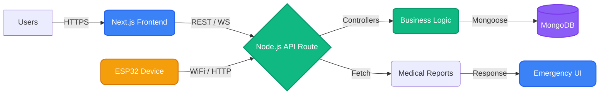

# Medi-Track

Healthcare appointment and medical history platform

  
    Press Space for next page <carbon:arrow-right class="inline"/>
  

  <a href="https://github.com/hrithik18k/Hack-a-Thon" target="_blank" alt="GitHub" title="Open in GitHub"
    class="text-xl slidev-icon-btn opacity-50 !border-none !hover:text-white">
    <carbon:logo-github />
  </a>
  <a href="https://medi-track-sable.vercel.app/" target="_blank" alt="Live Demo" title="Open Live Demo"
    class="text-xl slidev-icon-btn opacity-50 !border-none !hover:text-white">
    <carbon:link />
  </a>

<!--
Welcome to the Medi-Track presentation. Medi-Track is a comprehensive healthcare appointment and medical history platform that uniquely integrates with hardware for emergency access.
-->

---
transition: fade-out
layout: center
---

# Problem Statement

  <v-click>
    

      <carbon:warning-alt class="text-red-500 text-3xl" />
      
<strong>Fragmented Systems:</strong> Managing appointments, reports, and records is slow.

    

  </v-click>
  <v-click>
    

      <carbon:time class="text-orange-500 text-3xl" />
      
<strong>Emergency Delays:</strong> Identifying unconscious patients is difficult.

    

  </v-click>
  <v-click>
    

      <carbon:data-error class="text-yellow-500 text-3xl" />
      
<strong>Data Silos:</strong> Doctors lack immediate access to holistic medical history.

    

  </v-click>

<!--
The healthcare sector faces three primary challenges:
1. Systems are fragmented.
2. In emergencies, identifying an unconscious patient and accessing their medical history is critical but often delayed.
3. Doctors struggle with data silos.
-->

---
layout: image-right
image: https://images.unsplash.com/photo-1516549655169-df83a0774514?q=80&w=2070&auto=format&fit=crop
transition: slide-up
---

# Proposed Solution

Medi-Track provides an integrated ecosystem for all healthcare stakeholders:

- <carbon:user-multiple class="text-blue-500"/> **Patient booking** & profile management
- <carbon:document class="text-green-500"/> **Doctor report** management & publication
- <carbon:dashboard class="text-purple-500"/> **Admin dashboard** for oversight
- <carbon:notification class="text-yellow-500"/> **Real-time notifications** for updates
- <carbon:fingerprint-recognition class="text-red-500"/> **ESP32 fingerprint-based** emergency patient lookup

<!--
Our solution, Medi-Track, solves this by bridging the gap between software and hardware.
We provide a unified platform for patients, doctors, and admins. The standout feature is our ESP32-based biometric lookup for emergencies.
-->

---
layout: statement
---

# User Roles

Medi-Track is built for three primary users:

  

    <carbon:user class="text-5xl text-blue-400 mx-auto mb-4" />
    <h3 class="text-2xl font-bold">Patients</h3>
    
Book appointments, view medical history, setup biometrics

  

  

    <carbon:stethoscope class="text-5xl text-green-400 mx-auto mb-4" />
    <h3 class="text-2xl font-bold">Doctors</h3>
    
Manage appointments, review histories, publish reports

  

  

    <carbon:user-admin class="text-5xl text-purple-400 mx-auto mb-4" />
    <h3 class="text-2xl font-bold">Admins</h3>
    
System oversight, user management, analytics

  

<!--
The system caters to patients, doctors, and administrators, with tailored dashboards and permissions for each role.
-->

---
layout: two-cols
transition: slide-left
---

# Core Features

Discover the functionalities that power Medi-Track:

<v-clicks>

- <carbon:locked class="mr-2 text-blue-400" /> User registration and login
- <carbon:search class="mr-2 text-cyan-400" /> Doctor search and filtering
- <carbon:calendar class="mr-2 text-orange-400" /> Appointment booking system
- <carbon:document class="mr-2 text-green-400" /> Medical report publishing
- <carbon:reminder-medical class="mr-2 text-pink-400" /> Comprehensive medical history
- <carbon:chip class="mr-2 text-purple-400" /> Device setup for fingerprint scanner
- <carbon:warning-alt class="mr-2 text-red-400" /> Emergency patient identification

</v-clicks>

::right::

  

    
    

      

        

        System Online
      

    

  

<!--
Our core features cover the entire lifecycle of a medical visit, from booking to diagnosis and record keeping, enhanced by biometric emergency access.
-->

---
layout: center
class: text-center
---

# Unique Feature

### ESP32 Fingerprint Scanner Integration

  <carbon:fingerprint-recognition class="text-7xl text-blue-300 mx-auto mb-4" />
  <h2 class="text-2xl font-bold text-white mb-2">Emergency Patient Lookup</h2>
  

    In critical situations where a patient is unresponsive, medical staff can scan their fingerprint to instantly retrieve vital medical records, blood type, and allergies.
  

<!--
This is what sets us apart. Using an ESP32 microcontroller and a biometric fingerprint scanner, we created a hardware solution that integrates seamlessly with our web platform.
-->

---
layout: default
---

# Tech Stack

Built with modern, scalable technologies.

  

    <h3 class="flex items-center gap-2 text-xl font-bold text-blue-400 border-b border-gray-700 pb-2 mb-4">
      <carbon:laptop /> Frontend
    </h3>
    <ul class="space-y-2">
      <li><carbon:application-web class="mr-2" /> Next.js 14</li>
      <li><carbon:logo-react class="mr-2" /> React 18</li>
      <li><carbon:app-switcher class="mr-2" /> Redux Toolkit</li>
      <li><carbon:color-palette class="mr-2" /> Tailwind CSS</li>
    </ul>
  

  

    <h3 class="flex items-center gap-2 text-xl font-bold text-green-400 border-b border-gray-700 pb-2 mb-4">
      <carbon:data-base /> Backend
    </h3>
    <ul class="space-y-2">
      <li><carbon:bare-metal-server class="mr-2" /> Node.js & Express</li>
      <li><carbon:database-mongodb class="mr-2" /> MongoDB & Mongoose</li>
      <li><carbon:security class="mr-2" /> JWT Authentication</li>
      <li><carbon:api class="mr-2" /> Socket.io (Real-time)</li>
    </ul>
  

  <h3 class="flex items-center gap-2 text-xl font-bold text-orange-400 border-b border-gray-700 pb-2 mb-4">
    <carbon:iot-platform /> Hardware Integration
  </h3>
  

    <carbon:chip class="text-3xl" />
    ESP32 device with Fingerprint Sensor, integrated via API & WebSockets.
  

<!--
We chose a MERN-like stack with Next.js for SSR and SEO. Redux for state management. MongoDB for flexible schema design. Hardware uses ESP32 with C++ (Arduino framework).
-->

---
layout: center
---

# Architecture Overview

<!--
Here is the system architecture. Notice how the hardware directly communicates with our Node.js backend over WiFi to trigger the emergency lookup flow.
-->

---
layout: default
---

# Demo Flow

Here is what we will demonstrate today:

  <ol class="relative border-s border-gray-200 dark:border-gray-700 ml-4">
      <li class="mb-6 ms-6" v-click>
          
              1
          
          <h3 class="flex items-center mb-1 text-lg font-semibold text-gray-900 dark:text-white">Patient Onboarding</h3>
          
Patient registers, logs in, and enrolls their fingerprint.

      </li>
      <li class="mb-6 ms-6" v-click>
          
              2
          
          <h3 class="mb-1 text-lg font-semibold text-gray-900 dark:text-white">Appointment Booking</h3>
          
Patient finds a doctor and books an appointment.

      </li>
      <li class="mb-6 ms-6" v-click>
          
              3
          
          <h3 class="mb-1 text-lg font-semibold text-gray-900 dark:text-white">Doctor Management</h3>
          
Doctor reviews the appointment and publishes a medical report.

      </li>
      <li class="ms-6" v-click>
          
              <carbon:warning />
          
          <h3 class="mb-1 text-lg font-semibold text-red-600 dark:text-red-400">Emergency Scenario</h3>
          
Scanner reads fingerprint, instantly opening the patient's critical health records.

      </li>
  </ol>

<!--
Our demo will walk you through a typical patient journey, followed by an emergency situation where our hardware integration truly shines.
-->

---
layout: default
transition: slide-up
---

# Future Scope

We have big plans for Medi-Track's future:

  

    

      <carbon:hospital class="text-2xl text-blue-500" />
      <h3 class="text-xl font-semibold">Hospital-wide Deployment</h3>
    

    
Scaling the system for multi-hospital network connectivity.

  

  

    

      <carbon:devices class="text-2xl text-green-500" />
      <h3 class="text-xl font-semibold">Multi-device Support</h3>
    

    
Mobile applications for doctors and patients on iOS and Android.

  

  

    

      <carbon:notification class="text-2xl text-red-500" />
      <h3 class="text-xl font-semibold">Emergency Alert Integration</h3>
    

    
SMS and automated calls to emergency contacts upon scan.

  

  

    

      <carbon:chart-line class="text-2xl text-purple-500" />
      <h3 class="text-xl font-semibold">Analytics Dashboard</h3>
    

    
AI-driven insights for hospital management and disease tracking.

  

<!--
Looking ahead, we want to expand the platform's reach. Adding an AI layer for analytics and integrating with regional emergency dispatch systems are our next milestones.
-->

---
layout: center
class: text-center
---

# Thank You

  Any Questions?

  <a href="https://github.com/hrithik18k/Hack-a-Thon" target="_blank" class="flex items-center gap-2 px-4 py-2 bg-gray-800 text-white rounded-lg hover:bg-gray-700 transition !border-none !text-white">
    <carbon:logo-github />
    Source Code
  </a>
  <a href="https://medi-track-sable.vercel.app/" target="_blank" class="flex items-center gap-2 px-4 py-2 bg-blue-600 text-white rounded-lg hover:bg-blue-500 transition !border-none !text-white">
    <carbon:link />
    Live Demo
  </a>

<PoweredBySlidev mt-10 />

<!--
Thank you for your time and attention! We are happy to answer any questions about the platform, our hardware integration, or the codebase.
-->
